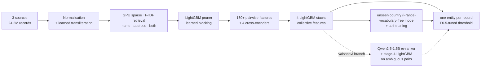

# Multilingual Business Entity Resolution at 24M-Record Scale

**Amazon ML Challenge 2026 · Team TeamCook · final public leaderboard score 0.989905 (macro F0.5)**

An end-to-end entity-resolution system that links noisy business records from three sources to the real business
they describe. It covers English, Indian and French data, names in nine scripts, and a country that never appears
in training. It combines GPU retrieval, learned blocking, gradient-boosted stacking, fine-tuned multilingual
transformers and, in the final version, an LLM re-ranker.


---

## Branches

| branch | contents | public leaderboard |
|---|---|---|
| **`main`** (this page) | the base pipeline: blocking, features, four stacks, cross-encoders, unseen-country transfer (v24) | 0.989584 |
| [`parth`](../../tree/parth) | the same code as `main`, with a technical walkthrough of how the base pipeline was built, v1 → v24 | 0.989584 |
| [`vaishnavi`](../../tree/vaishnavi) | **final submission (v28):** wider candidate set, a fine-tuned Qwen2.5-1.5B re-ranker with a stage-4 model, and a verified one-command reproducible release | **0.989905** |

## At a glance

| | |
|---|---|
| **Scale** | 24.2M records: 2.2M train and 1.73M test entities, 10.3M and 9.97M records to link |
| **Search space** | 6.72 × 10¹² same-country entity–record pairs reduced to 8.3M candidates (**99.9999 %** reduction), keeping **98.3 %** of true matches |
| **Accuracy** | **0.9918** out-of-fold macro F0.5 on 2.2M training entities; **0.9899** on the public leaderboard |
| **Models** | LightGBM stacks, XLM-RoBERTa base/large and mDeBERTa-v3 cross-encoders, a fine-tuned Qwen2.5-1.5B classifier |
| **Compute** | 4× NVIDIA H200 (DDP), 192 CPU cores, 1 TB RAM |
| **Reproducibility** | Verified in a fresh environment: byte-identical candidate file, 99.96 % identical predictions (`vaishnavi` branch) |

## The problem

Each business has one reference record (Source 1) and many noisy copies in Sources 2 and 3. The task is to find, for
every reference entity, all records that describe it. The score is F0.5 averaged over entities, singletons included,
so **a wrong merge costs about four times as much as a missed match**.

* **Noise:** typos, abbreviations, reordered words, legal-form variants (Pvt Ltd / Private Limited / SARL), missing
  addresses, digit drops in house numbers, and names in Devanagari, Telugu, Bengali and six other scripts.
* **Designed decoys:** look-alike businesses on the same street a few doors away ("Acme Foods" at no. 2501 vs
  "Acme Foods Group" at no. 2508) that fool plain string similarity.
* **A country never seen in training:** France makes up 15 % of the test set and has no labels. Its vocabulary
  flips meaning: French *"et Fils"* is noise, while English *"& Sons"* marks a different business.

## Architecture



## Key techniques

1. **Record-side GPU retrieval.** Every record belongs to at most one entity, so the search runs from the record
   side. Exact sparse TF-IDF cosine is computed as `sparse × dense` products (`torch.sparse.mm`) on 4 GPUs, at about
   3.4k queries/s per GPU, with no approximate index and no recall lost to one.
2. **Learned blocking.** A LightGBM pruner scores retrieved pairs on cosines, ranks, margins and cheap string and
   house-number signals. It keeps 98.3 % of true pairs at 4.8 candidates per entity.
3. **Out-of-fold target encoding of differences.** Tokens that a record *adds* to or *drops* from the entity name
   are encoded with their match rate, computed out-of-fold. The model learns that "+ Group" marks a decoy and
   "+ Center" is noise. This was the largest single gain (+0.0018 F0.5).
4. **Collective (group-aware) stacking.** A second-level LightGBM sees how each pair competes with the record's
   other candidate entities, with the entity's most confident sibling record, and with "name twins".
5. **Multilingual cross-encoders.** XLM-R base and large and mDeBERTa-v3 are fine-tuned with PyTorch DDP and
   cross-fitted on entity halves, so every training pair gets an out-of-fold score. A blend of four differently
   configured stacks makes the final decisions for seen countries.
6. **Zero-shot transfer to an unseen country.** For France, which has no labels:
   * a *vocabulary-free* inference mode, trained with 30 % dropout of vocabulary features;
   * **label-free** word statistics (does a word appear on the same house number or a nearby one?);
   * a cross-encoder **self-trained** on pseudo-labels and cross-fitted, so that no pair scores itself.
7. **Simulation for robustness.** Deleting 19 % of entities creates orphan records, and cloning 8 % of true records
   at nearby house numbers creates decoys. On held-out clone decoys, false merges fell from 42 % to 4.7 %.
8. **LLM re-ranking on the hard cases** (`vaishnavi` branch). A **Qwen2.5-1.5B** sequence classifier is fine-tuned
   only on the ambiguous band, which holds 7.6 % of pairs but 99.8 % of the remaining misses. A stage-4 LightGBM
   uses its score to re-decide those pairs.

## Results

| version | main change | branch | public leaderboard |
|---|---|---|---|
| v4 | pairwise + collective LightGBM | `main`/`parth` | 0.9797 |
| v8 | + decoy-injection training, leaner blocking, XLM-R cross-encoders | `main`/`parth` | 0.98658 |
| v11 | + vocabulary-free additions for the unseen country | `main`/`parth` | 0.98826 |
| v17 | + France structural corrections, self-trained French cross-encoder | `main`/`parth` | 0.989458 |
| v24 | + blend of four stacks | `main`/`parth` | 0.989584 |
| v25 | + wider candidate set, re-scored without retraining | `vaishnavi` | 0.989747 |
| **v28** | **+ Qwen2.5-1.5B re-ranker and stage-4 re-decision** | **`vaishnavi`** | **0.989905** |

Out-of-fold macro F0.5 on all 2.2M training entities (US/India): 0.991303 (v24) → 0.991625 (v25) → **0.991843 (v28)**.
The fold-to-fold noise floor is ≈ 5·10⁻⁵.

## Engineering highlights

* **Leakage-safe validation.** Every model, target encoding and cross-encoder is cross-fitted by entity folds or
  halves. Offline scores are re-weighted to the test country mix before they are compared with the leaderboard.
* **Four validation frames** in place of one: the original data, simulated orphan records, noisy decoys, and
  held-out clone decoys that no model was trained on.
* **Metric-faithful decisions.** Thresholds are tuned on the exact macro-F0.5 metric. A per-bucket threshold that
  looked like a clear gain under pooled precision and recall lowered the real metric, so it was rejected.
* **Efficient compute:**
  * DDP fine-tuning with bf16 autocast;
  * one model per GPU for bulk scoring;
  * multi-process feature pipelines on 192 cores;
  * GPU retrieval over 233M query–entity pairs in about 20 minutes per split.
* **Verified reproduction** (`vaishnavi` branch): the released code was re-run in a fresh environment.
  * The candidate file came out byte-identical to the submission.
  * Normalisation and features came out identical.
  * The retrained pruner kept the same recall (0.98293 vs 0.98294).
  * The first stack matched its documented validation score exactly (0.99007).

## Tech stack

**Modelling:** LightGBM · PyTorch · Hugging Face Transformers · XLM-RoBERTa · mDeBERTa-v3 · Qwen2.5 ·
scikit-learn &nbsp;|&nbsp; **Data:** Polars · NumPy · SciPy sparse · RapidFuzz &nbsp;|&nbsp;
**Infrastructure:** CUDA · DDP (`torchrun`) · multi-process CPU pipelines

## Repository structure (`main`)

```
├── run_pipeline.sh            # end-to-end run: data → blocking → matching → output files
├── src/
│   ├── text_norm.py, translit.py, preprocess.py    # normalisation, IBM-Model-1 transliteration
│   ├── blocking.py, stage1.py                      # GPU TF-IDF retrieval, LightGBM pruner
│   ├── features.py, match.py, simulate.py          # features, stacks, target encoding, simulations
│   ├── cross_encoder.py                            # multilingual cross-encoders (DDP)
│   ├── ensemble_seen.py, combine.py, make_submission.py
│   └── france_rules.py, ce_france.py, predict_france.py, typecal.py   # unseen-country path
├── docs/
│   ├── METHODOLOGY.md         # full write-up: EDA, every version, validation tables
│   └── REPRODUCTION.md        # step-by-step commands and outputs
└── requirements.txt           # pinned dependencies (Python 3.11)
```

## Quickstart

```bash
python3.11 -m venv .venv && .venv/bin/pip install -r requirements.txt
BER_DATA=/path/to/dataset BER_CACHE=/path/to/work BER_OUTPUT=/path/to/output PY=.venv/bin/python bash run_pipeline.sh
```

For the final version with the one-command resumable runner, check out the `vaishnavi` branch
(`git checkout vaishnavi`, then see its README). The competition data is not included in this repository.

## Lessons learned

* **Blocking sets the ceiling.** The perfect-matcher ceiling on the final candidates is 0.9954, and about half of
  the remaining loss is pairs that blocking never finds.
* **Offline wins must survive the real metric and the real data mix.** A US/India-only offline score of 0.992 became
  0.990 on the leaderboard once the unseen country (15 % of entities, ≈ 0.980) was weighted in.
* **Transfer is about meaning, not just vocabulary.** Multilingual models carried English word meanings into French.
  Label-free structural statistics fixed what pretrained knowledge got wrong.
* **The last errors are name-only records** that share a name with other businesses. A production system would add
  signals such as phone numbers or registry IDs.

## Team

**TeamCook:** Parth Pitrubhakta, Vaishnavi Bholane.

* **Parth Pitrubhakta:** base pipeline (v1 → v24), see the [`parth`](../../tree/parth) branch.
* **Vaishnavi Bholane:** final-stage extensions and reproducible release (v25 → v28), see the
  [`vaishnavi`](../../tree/vaishnavi) branch.

## Data, models and licences

* No external data, APIs or look-up services are used; only the provided competition data and public pretrained
  checkpoints.
* **Pretrained models:** XLM-RoBERTa base and large (MIT), mDeBERTa-v3-base (MIT) and Qwen2.5-1.5B (Apache-2.0),
  all under 8B parameters.
* The competition dataset and the predictions are **not** redistributed here.

## License

Code released under the [MIT License](LICENSE).
