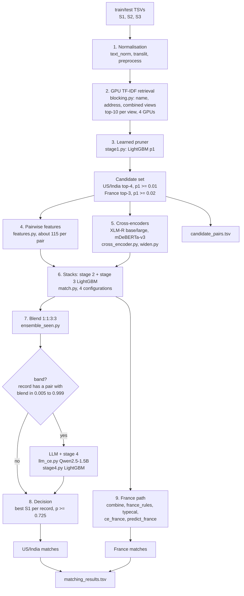

# Architecture: Business Entity Resolution (TeamCook, final submission v28)

This document describes how the pipeline is built: its stages, the data each stage consumes and produces, and how
the parts fit together. For the reasoning and results behind each design choice, see `METHODOLOGY.md`.
For the exact commands, see `REPRODUCTION.md` and `src/run_pipeline.py`.

## 1. Problem shape

* **Input.** Source 1 (S1) business entities, and Source 2/3 (S2/S3) records, each with a name, an address and a
  `country` label.
* **Output.** For every test S1 entity, the S2/S3 records that are the same business (`matching_results.tsv`) and
  the candidates the matcher scored (`candidate_pairs.tsv`).
* **Metric.** F0.5 per S1 entity, macro-averaged over all entities including singletons, so precision counts more
  than recall.
* **Structural facts the architecture relies on.**
  * Each S2/S3 record belongs to **at most one** S1 entity, so the pipeline works record-side: retrieval, pruning
    and the final decision are all "which S1, if any, does this record belong to".
  * `country` is an open label. France appears only in test, so no component may depend on a fixed country list.
  * The data contains designed distractors: records on the same street at a nearby house number, often with an
    extra name token. House-number relations and collective (group) evidence separate them from true matches.

## 2. Pipeline at a glance



## 3. Stages

| # | stage | module(s) | input → output (in `cache/` unless noted) | key idea |
|---|---|---|---|---|
| 1 | normalisation | `text_norm.py`, `translit.py`, `preprocess.py` | TSVs → `{split}_norm.parquet` | legal forms, street types, house-number parsing, IBM Model-1 transliteration learned from train pairs |
| 2 | retrieval | `blocking.py` | norm → `{split}_retrieval.parquet` | exact sparse TF-IDF cosine per country block, top-10 per view |
| 3 | pruning | `stage1.py` | retrieval → `{split}_stage1.parquet` (p1) | LightGBM on retrieval scores, ranks, margins and cheap similarities |
| 4 | candidates + pair features | `match.py features`, `widen.py feats`, `features.py` | stage1 → `{split}_feats.parquet`, `w_{split}_feats.parquet` | final candidate rule; about 115 country-agnostic features |
| 5 | cross-encoders | `cross_encoder.py`, `widen.py ce` | pairs → `ce_scores_{split}*.parquet`, `w_ce_{split}_*.parquet` | pair classifiers on raw "name \| address", cross-fitted by S1 half |
| 6 | stacks | `match.py train/predict`, `widen.py score` | features + CE → `test_scores{tag}.parquet`, `w_test_scores{tag}.parquet` | stage 2 pairwise model, stage 3 group-aware stacker |
| 7 | blend (US/India) | `ensemble_seen.py` | 4 stack scores → blended score | weights full:1, vf:1, vfb:3, vfm:3 |
| 8 | ambiguous band | `llm_ce.py`, `stage4.py` | band pairs → `llm/llm_scores_{split}.parquet` → re-scored band | LLM pair score + second-level LightGBM |
| 9 | France | `combine.py`, `typecal.py`, `france_rules.py`, `ce_france.py`, `predict_france.py` | stack outputs → `output/v12` … `output/v24` | label-free structural corrections and self-training |
| 10 | outputs | `ensemble_seen.py`, `stage4.py predict`, `widen.py cands` | → `output/*.tsv` | matches ⊆ candidates, one S1 per record |

## 4. Components

### 4.1 Normalisation (`text_norm.py`, `translit.py`, `preprocess.py`)
* **Names.** Case, accents and punctuation are folded ("&" becomes "and"). Legal forms and honorifics are split
  off per country (US/India forms plus French SARL, SAS, SASU, EURL, SCI, SNC, EI). This produces a core name, a
  consonant skeleton, an acronym and website stems.
* **Addresses.** Street-type dictionaries (Rd/Road, rue/r, avenue/av, allée …) are applied, and departments are
  mapped to regions (Nord → Hauts-de-France). The parser also extracts the city, the state, the postal code and
  comma components.
* **House numbers.** They are parsed into a comparable composite form ("2-37-2", "25/2", "1427-1431",
  "N° 36", "9 ter"), because they are the strongest precision signal.
* **Transliteration.** Native-script names (Devanagari, Tamil, …) are transliterated to Latin with a word
  dictionary learned by IBM Model 1 from the training pairs only.
* **Parallelism.** A `multiprocessing.Pool` runs over all CPU cores; the output is one parquet row per record.

### 4.2 Candidate generation (`blocking.py`, `stage1.py`, `widen.py`)
* **Blocks.** Every distinct `country` label is its own block, so France is handled with no special case.
* **Views.** There are three sparse TF-IDF views: name (char 3-grams, words and skeletons of the core name),
  address (words, char 3-grams, comma-component bigrams and canonical state) and combined. All use sublinear TF,
  per-block IDF and L2 normalisation.
* **GPU retrieval.** Similarities are exact `torch.sparse` products (sparse S1 × dense query chunk). Record chunks
  are sharded over **4 GPUs, one worker process per GPU** (`CUDA_VISIBLE_DEVICES`). Each record keeps its top-10
  S1 per view, and the union recalls 98.84% of true pairs.
* **Pruner.** A LightGBM with 400 trees and 37 features scores every retrieved pair (p1). Its features are the
  cosines, ranks, gaps to the record's best S1, runner-up margins, how many records retrieved the S1, cheap
  name/address ratios, and house-number equality and difference.
* **Final candidate rule.**
  * **US/India:** each record's top-4 S1 by p1 with p1 ≥ 0.01 (`widen.py`).
  * **France:** top-3 with p1 ≥ 0.02.
  * **Test totals:** 8.93M pairs, **5.15 candidates per S1**, 98.49% pair recall (train). This exact set is
    written to `candidate_pairs.tsv`, and it is the set the matchers score.

### 4.3 Pairwise features (`features.py`)
There are about 115 features. None of them use `country` or vocabulary identity directly, so they transfer to
unseen countries.

| group | examples |
|---|---|
| name | rapidfuzz ratio, token sort/set, partial, Jaro-Winkler, Levenshtein on core/full/skeleton, space-stripped, acronym, first-token equality, legal-form equality/conflict/missing, name frequency |
| address | ratio, token sort/set, token Jaccard/containment, comma-component match, city containment, state and postal agreement, empty flags |
| house number | composite equality/ratio/containment, number-set Jaccard, near-miss (±20), relation type (equal/suffix/prefix/indel/substitution/near), "near only, none equal" |
| retrieval context | the three cosines and ranks, p1, record and S1 candidate counts and ranks |

String similarities use `rapidfuzz.process.cpdist`, which is multithreaded C++. Set features run in a process
pool.

### 4.4 Cross-encoders (`cross_encoder.py`)
* **Models:** XLM-RoBERTa-base (`ce`), XLM-RoBERTa-large (`cel`, and `cel2` after a second epoch) and
  mDeBERTa-v3-base (`cem`). All are MIT-licensed.
* **Input:** the raw pair "name | address" of both sides, truncated to 128 tokens.
* **Cross-fitting:** by S1 half (`hash(s1_id, seed 99) % 2`). Model m trains on half m and scores the other half,
  so every training pair has an out-of-fold score; test pairs get the average of both models.
* **Training:** `torchrun` DDP on 4 H200s with bf16 autocast and length-sorted batches. Scoring the widened
  candidates runs one model variant per GPU concurrently (`widen.py ce`).

### 4.5 Stacks (`match.py`)
Each stack is a two-level LightGBM, cross-fitted in 5 folds by S1 (`hash(s1_id, seed 42) % 5`).

* **Stage 2 (pairwise).** 400 rounds. Inputs are the pairwise features, p1, and out-of-fold target encodings of
  what the record adds to or drops from the S1 name and address (tokens, legal-form transitions, one-word swaps,
  city changes). Label-free token statistics are also used (see the stack table below). 30% of entities have
  their target encodings masked during fitting, so the model can also decide without them.
* **Stage 3 (collective).** 250 rounds, on the stage-2 inputs plus group features computed from p2:
  * the record's best, second-best and summed scores, and this pair's margin;
  * the S1's count and sum of confident records, and this pair's rank among them;
  * similarity to the S1's most confident other record;
  * "name twins": how many same-named records go to this S1, elsewhere, or nowhere.
* **Training frames.** Original data, plus an orphan simulation (19% of S1 deleted, so their records become
  orphans), plus an injected near-miss decoy frame (8% of true records cloned at a nearby house number). This
  teaches the model the distractor density of the test data.
* **Configurations** (`MODEL_TAG`):

  | tag | cross-encoders | notes |
  |---|---|---|
  | `full_` | ce, cel | full vocabulary, no token statistics |
  | `vf_` | ce, cel, cel2 | label-free token statistics (the leave-one-out share of a word's pairs at an identical house number, which separates noise words from decoy words); vocabulary features masked for countries unseen in training |
  | `vfb_` | ce, cel, cel2 | vf, seed 7, learning rate 0.05, 800/500 rounds |
  | `vfm_` | ce, cel, cel2, cem | vf + mDeBERTa |

### 4.6 Decision (US/India): blend, band, stage 4 (`ensemble_seen.py`, `llm_ce.py`, `stage4.py`)
1. **Blend.** p = (full + vf + 3·vfb + 3·vfm) / 8.
2. **Band.** A record is ambiguous if any of its pairs has a blend in [0.005, 0.999). That is 7.6% of pairs, and it
   holds 99.8% of the out-of-fold missed matches and 95.8% of the wrong acceptances.
3. **LLM pair classifier.** Qwen2.5-1.5B (Apache-2.0, 1.54B parameters) with a last-token classification head
   reads `Entity: <name | address>` / `Record: <name | address>`.
   * It is fine-tuned on the band pairs of each S1 half: 1 epoch, lr 1.5e-5, bf16. Both halves train at once with
     **DDP on 2 GPUs each**, using all 4 H200s.
   * Model m scores the other half. Test pairs are scored by the model of their entity's other half, so train and
     test scores have the same distribution.
4. **Stage 4.** A LightGBM (400 trees, 5-fold by S1) re-scores the band pairs. It sees 139 features: the 4 stack
   scores, the blend, the LLM score (rank, gap and margin within the record; rank within the S1), record and S1
   context, all pairwise features, and the 4 cross-encoder logits. Pairs outside the band keep the blend.
5. **Assignment.** Each record goes to its best-scoring S1 if the score is ≥ 0.725, and to no S1 otherwise.
   Thresholds were tuned for macro F0.5 on out-of-fold data and checked on the harder frames and the leaderboard.

### 4.7 France path (country unseen in training)
France is decided separately, because vocabulary-dependent signals (target encodings, English-trained
cross-encoders) transfer wrongly: French noise words such as "groupe" read as the US decoy word "group". The chain
runs from `output/v12` to `output/v24`:
1. **`combine.py` (v12).** Starts from the full-stack decisions and adds vocabulary-free matches only in change
   types that are about 99% true in training.
2. **`typecal.py`.** Defines vocabulary-free pair types (address × legal-form × street × name relation) calibrated
   on US/India truth.
3. **`france_rules.py` (v13–v16).** Label-free structural corrections: descriptor-swap decoys, the "groupe" and
   "services" noise words, and high-truth types.
4. **`ce_france.py` (v17, v18).** Self-trains XLM-R-large on French pseudo-labels, cross-fitted by French S1 half,
   over two rounds, gated by the type prior.
5. **`predict_france.py` (v21).** Re-scores French pairs with the full stack, using French out-of-fold target
   encodings and the French cross-encoder.
6. **`france_rules.py tighten` (v24).** Keeps the leaderboard-confirmed v17 state, plus only the post-v17 changes
   that the cross-encoders and the type prior both confirm.

The final output takes the v24 France rows unchanged. `ensemble_seen.py` and `stage4.py` replace only the rows of
countries seen in training.

## 5. Invariants (checked in code and by the official validator)
* **Coverage:** exactly one output row per test S1 entity, including the 5.8% with no match.
* **One S1 per record:** a record is matched to at most one S1 (`write_pairs` asserts it).
* **Matches ⊆ candidates:** every matched id appears in that entity's candidate row.
* **Candidates = scored pairs:** `candidate_pairs.tsv` is exactly the set the matchers scored. For US/India,
  `widen.py cands` writes `w_test_feats`, the same set the stacks and stage 4 score; France keeps its own set.
* **Out-of-fold discipline:** every score used as a model input on training data is out-of-fold (pruner held-out
  fold, S1-fold stacks and stage 4, S1-half cross-encoders and LLM).
* **Open country label:** no country-specific branching except "seen vs unseen in training", which is computed
  from the data.

## 6. Validation design
* **Metric.** The exact macro F0.5 (per S1, singletons included) is implemented identically in `common.py`, the
  evaluation scripts and `stage4.py`.
* **Folds.** 5 folds by S1 id for the LightGBM models and 2 S1 halves for the transformers. Fold-to-fold SD of
  F0.5 is about 5·10⁻⁵, which sets the noise floor for accepting a change.
* **Frames.** Clean out-of-fold data; orphan-simulated data, which matches the test's unmatched-record density
  (≈2.3 per S1); noisy decoy injection; held-out clone decoys that no model trains on; and pseudo-new-country data
  (vocabulary hidden).
* **Country weighting.** Offline US/India numbers are re-weighted to the test mix (India 46.8%, US 38.3%, France
  15.0%) before comparing with the leaderboard.

## 7. Hardware use (4× H200, 192 cores, 1 TB RAM)
| stage | parallelism |
|---|---|
| normalisation, pair features | process pools over all cores; polars/rapidfuzz multithreading |
| retrieval | record chunks sharded over 4 GPUs, one worker per GPU |
| cross-encoder training | `torchrun --nproc_per_node=4` DDP, bf16 |
| cross-encoder scoring (widened set) | 4 concurrent single-GPU jobs, one model variant per GPU |
| LLM fine-tuning | two DDP jobs of 2 GPUs each (one per S1 half), 98% utilisation |
| LightGBM stacks / stage 4 | 96–160 threads; independent stacks scored concurrently |

## 8. Models and licences
| model | licence | parameters | role |
|---|---|---|---|
| LightGBM | MIT | n/a | pruner, stage 2, stage 3, stage 4 |
| XLM-RoBERTa-base | MIT | 279M | cross-encoder `ce` |
| XLM-RoBERTa-large | MIT | 561M | cross-encoders `cel`, `cel2`; French self-trained cross-encoder |
| mDeBERTa-v3-base | MIT | 278.8M | cross-encoder `cem` |
| Qwen2.5-1.5B | Apache-2.0 | 1,543,714,304 | band pair classifier (v28) |

All models are at most 8B parameters. No external data or look-up services are used; everything is learned from
the provided train and test files.

## 9. Reproduction
`src/run_pipeline.py` is the single entry point. It runs 25 steps end to end:

```
python src/run_pipeline.py --data_dir <dataset> --output_dir <out> --work_dir <work> --gpus 0,1,2,3
```

Every step caches its output in `<work>`, so a run can be resumed with `--from_step N`, and `--list` prints the
steps. The four stack configurations (`MODEL_TAG`, `CE_VARIANTS`, …) and the final blend (1:1:3:3 at 0.725) are
fixed in `run_pipeline.py`.

The final files are `<out>/matching_results.tsv` and `<out>/candidate_pairs.tsv`. Check them with
`src/verify_outputs.py` and the official `utils/validate_submission.py --check-ids`.
